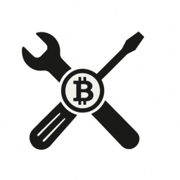

# BRC-20 Kit

**The Universal BRC-20 Developer Kit**

> The forkable SDK for building and minting your BRC-20 tokens.

**Version**: 1.0.0  
**Status**: Production Ready  
**Last Updated**: January 2025  
**Website**: [brc20kit.com](https://brc20kit.com)

---

A Bitcoin-native application for minting BRC-20 tokens using advanced chained PSBT technology. Built with Next.js 16, supporting 6+ Bitcoin wallets, enabling 1-25 token mints in a single optimized flow with configurable white-label platform fees.

**100% Client-Side** • **Zero Backend Required** • **Fork & Deploy in Minutes**

---

## 🚀 Quick Start

Deploy your own BRC-20 minting portal in just 10 minutes:

**[📖 Getting Started Guide →](docs/GETTING_STARTED_10_MINUTES.md)**

### Quick Deploy

1. **Fork** this repository on GitHub
2. **Get Unisat API token** from [open-api.unisat.io](https://open-api.unisat.io) (takes 2 minutes)
3. **Deploy to Vercel** - Click the button below
4. **Add environment variables** (see [Configuration](#configuration) below)
5. **Done!** Your portal is live

**Need help?** See the [10-minute getting started guide](docs/GETTING_STARTED_10_MINUTES.md) for step-by-step instructions.

---

## ✨ Key Features

### 🎨 White-Label Configuration System

Easily configure your mint portal via environment variables:

\`\`\`bash
# Token Defaults (pre-fill mint form)
NEXT_PUBLIC_DEFAULT_TICKER=MYTOKEN
NEXT_PUBLIC_DEFAULT_AMOUNT=1000
NEXT_PUBLIC_DEFAULT_NUM_MINTS=1
NEXT_PUBLIC_DEFAULT_FEE_RATE=10

# Platform Fees (optional)
NEXT_PUBLIC_COMMISSION_WALLET_ADDRESS=bc1your_address
NEXT_PUBLIC_COMMISSION_AMOUNT_BTC=0.00000330  # 330 sats

# Branding (optional)
NEXT_PUBLIC_LOGO_URL=/logo.svg
NEXT_PUBLIC_PROJECT_NAME=YourProject
\`\`\`

**Transaction Structure:**
- **First Mint**: OP_RETURN + Commission (optional) + Change (3 outputs)
- **Chained Mints**: OP_RETURN + Change (2 outputs, no commission)

### 🔌 Universal Wallet Support

Integrated via [LaserEyes](https://github.com/omnisat/lasereyes) for seamless multi-wallet support:

- ✅ **Unisat Wallet** - Popular Bitcoin wallet with full BRC-20 support
- ✅ **Xverse Wallet** - Taproot-native wallet with Stacks integration
- ✅ **OKX Wallet** - Multi-chain wallet from OKX exchange
- ✅ **Phantom Wallet** - Multi-chain wallet with Bitcoin support
- ✅ **Magic Eden Wallet** - NFT marketplace wallet
- ✅ **Leather Wallet** - Bitcoin and Stacks wallet

### ⛓️ Chained PSBT Minting (1-25 Tokens)

- Sequential transaction signing with progress tracking
- Automatic fee calculation for entire chain
- Error recovery and state management
- Dust threshold handling (330 sats minimum)

### 💰 Dynamic Fee Estimation

- Real-time fee rates from mempool.space
- Three speed tiers: Slow, Medium, Fast
- Custom fee rate support
- Network congestion indicators

### ✅ UTXO Validation

- Pending transaction detection
- Balance verification including commission
- Available vs locked UTXO categorization
- Real-time mempool monitoring

### 📚 Comprehensive Documentation

- Technical PSBT construction guide
- Wallet SDK compatibility matrix
- Complete project status tracking
- Architecture documentation

---

## ⚙️ Configuration

### Required Variables

**🔴 Unisat API Token (CRITICAL - Required for minting to work)**

Get your free token from [https://open-api.unisat.io](https://open-api.unisat.io)

\`\`\`env
UNISAT_API_TOKEN=your_token_here
\`\`\`

**Why needed:** All UTXO and balance queries use Unisat API. Without this, minting won't work.

**Token Settings (Required):**

\`\`\`env
NEXT_PUBLIC_NETWORK=mainnet
NEXT_PUBLIC_DEFAULT_TICKER=ANY
NEXT_PUBLIC_DEFAULT_AMOUNT=1
\`\`\`

**Note:** Users cannot change ticker or amount in the UI. These are hardcoded from environment variables.

### Optional: Platform Fees

Collect a small fee on the first mint of each chain:

\`\`\`env
NEXT_PUBLIC_COMMISSION_WALLET_ADDRESS=bc1q...
NEXT_PUBLIC_COMMISSION_AMOUNT_BTC=0.00000330  # 330 sats recommended
\`\`\`

**Note**: Commission is only charged once per minting session (on the first transaction). Subsequent mints in the chain are commission-free for users.

### Optional: Branding

\`\`\`env
NEXT_PUBLIC_PROJECT_NAME=YourProjectName
NEXT_PUBLIC_LOGO_URL=/logo.svg
\`\`\`

**Complete Reference**: See [docs/CONFIGURATION.md](docs/CONFIGURATION.md) for all configuration options.

---

## 🏗️ How It Works

- **100% Client-Side** - All PSBT construction happens in your browser
- **No Backend Required** - Your keys never leave your wallet
- **Universal Wallet Support** - Works with 6+ Bitcoin wallets via LaserEyes SDK
- **Chained Minting** - Create 1-25 linked transactions in a single flow

**For technical details**, see [docs/advanced/](docs/advanced/) documentation.

---

## 📖 Documentation

### Getting Started

- **[📖 Getting Started in 10 Minutes](docs/GETTING_STARTED_10_MINUTES.md)** - Step-by-step deployment guide
- **[⚙️ Configuration Guide](docs/CONFIGURATION.md)** - Complete environment variables reference
- **[❓ FAQ](docs/FAQ.md)** - Common questions and troubleshooting

### For Developers

- **[NEXT_STEPS.md](NEXT_STEPS.md)** - Advanced customization and development
- **[docs/advanced/](docs/advanced/)** - Technical documentation (PSBT flow, architecture, etc.)

---

---

---

---

---

## 🤝 Contributing & Community

We welcome contributions! Whether you're fixing bugs, adding features, or improving documentation, your help is appreciated.

### Get Involved

- ⭐ **Star us on GitHub** - Help others discover this project
- 🐛 **Report bugs** - [Open an Issue](https://github.com/The-Universal-BRC-20-Extension/brc20kit/issues)
- 💬 **Join discussions** - [GitHub Discussions](https://github.com/The-Universal-BRC-20-Extension/brc20kit/discussions)
- 🔀 **Submit PRs** - Fork, make changes, and open a Pull Request
- 📖 **Improve docs** - Help make documentation clearer

### Quick Links

- **GitHub:** [github.com/The-Universal-BRC-20-Extension/brc20kit](https://github.com/The-Universal-BRC-20-Extension/brc20kit)
- **Issues:** [Report a Bug](https://github.com/The-Universal-BRC-20-Extension/brc20kit/issues)
- **Discussions:** [Join the Discussion](https://github.com/The-Universal-BRC-20-Extension/brc20kit/discussions)
- **Website:** [brc20kit.com](https://brc20kit.com)

### How to Contribute

1. **Fork** this repository
2. **Create** a feature branch (`git checkout -b feature/amazing-feature`)
3. **Make** your changes
4. **Commit** (`git commit -m 'Add amazing feature'`)
5. **Push** (`git push origin feature/amazing-feature`)
6. **Open** a Pull Request

See [CONTRIBUTING.md](CONTRIBUTING.md) for detailed guidelines.

---

## 🔒 Security

### Security Features Implemented

✅ Client-side only (no server-side private key handling)  
✅ PSBT validation before signing  
✅ Fee sanity checks (prevents excessive fees)  
✅ Dust threshold enforcement (330 sats minimum)  
✅ Commission address validation  
✅ Transaction chain consistency validation  
✅ Input validation and sanitization

### Best Practices for Users

- **Always verify** transaction details before signing
- **Use hardware wallets** for large amounts
- **Double-check** commission address in configuration
- **Keep private keys secure** - never share or store unencrypted

### Reporting Security Vulnerabilities

**Do not** open public GitHub issues for security vulnerabilities.

Instead, please email: **arkano1dev@proton.me**

We will respond promptly and work with you to address the issue.

See [SECURITY.md](SECURITY.md) for our complete security policy.

---

## 📄 License

MIT License - see [LICENSE](LICENSE) file for details.

This means you can:
- ✅ Use commercially
- ✅ Modify
- ✅ Distribute
- ✅ Use privately

Just include the original license and copyright notice.

---

## 💬 Support

### Get Help

- **📖 Documentation**: [Getting Started Guide](docs/GETTING_STARTED_10_MINUTES.md)
- **❓ FAQ**: [Common Questions](docs/FAQ.md)
- **🐛 Report Bug**: [GitHub Issues](https://github.com/The-Universal-BRC-20-Extension/brc20kit/issues)
- **💬 Discussions**: [GitHub Discussions](https://github.com/The-Universal-BRC-20-Extension/brc20kit/discussions)

### Commercial Support

For white-label deployments, custom integrations, or priority support:
- **Email**: arkano1dev@proton.me
- **Website**: [brc20kit.com](https://brc20kit.com)

---

## 🙏 Acknowledgments

Built with excellent open source tools:

- [Next.js](https://nextjs.org) - React framework
- [LaserEyes](https://github.com/omnisat/lasereyes) - Universal Bitcoin wallet SDK
- [bitcoinjs-lib](https://github.com/bitcoinjs/bitcoinjs-lib) - Bitcoin transaction library
- [shadcn/ui](https://ui.shadcn.com) - Beautiful UI components
- [mempool.space](https://mempool.space) - Bitcoin explorer and API
- [Tailwind CSS](https://tailwindcss.com) - Utility-first CSS framework

Special thanks to the Bitcoin and Ordinals communities for their pioneering work.

---

**Ready to launch your own BRC-20 mint portal?** 

👉 **[Get Started in 10 Minutes →](docs/GETTING_STARTED_10_MINUTES.md)**

---

**⭐ Star us on GitHub** | **🐛 Report Issues** | **💬 Join Discussions**

[GitHub](https://github.com/The-Universal-BRC-20-Extension/brc20kit) • [Issues](https://github.com/The-Universal-BRC-20-Extension/brc20kit/issues) • [Discussions](https://github.com/The-Universal-BRC-20-Extension/brc20kit/discussions)

---

*Built with ⚡ by Arkano1dev*
